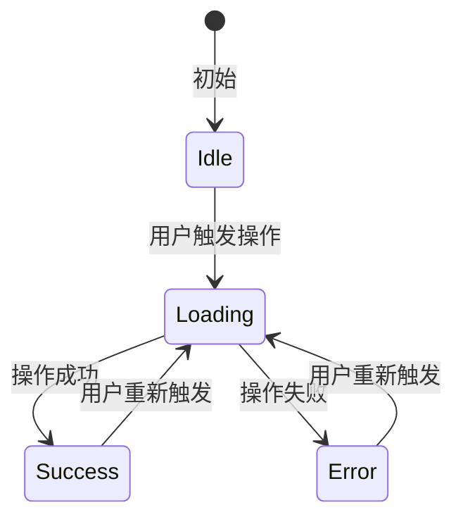

# 桌面应用功能设计（Functional Design for Desktop Application）

本技能用于对桌面应用程序的**单个功能/模块**进行详细设计。与架构设计关注"系统宏观骨架"不同，功能设计关注的是"具体功能的内部结构"：该功能如何通过 IPC 暴露给前端？前后端状态如何管理？数据如何持久化？错误如何处理？

本技能必须引用已有的架构设计文档，且不得违反架构设计中的任何决策。同时，**必须**基于需求文档中的具体用例进行设计。如果相关内容缺失，请要求用户提供。


## 基础准则

- 本 Skill 的所有问答优先使用交互式组件（如复选框、下拉菜单）进行提问；若平台不支持，则使用清晰的编号列表在聊天中提问。
- 当用户明确回答"没有其他问题"或"进入下一步"时，AI不得继续追问，必须进入下一步（避免无限循环）。但若本轮讨论中用户提出的新要点尚未达成共识，AI必须先回到相应要点继续讨论，直到所有已提出的要点均已确认，才能进入下一步。


## 目标

本 Skill 的目标是产出一份**功能级详细设计文档**，该文档需明确：

1. **设计概述**：该功能要完成什么、对应哪个需求用例、涉及哪些模块。
2. **模块职责**：新增/改动的模块及其在架构分层中的位置。
3. **IPC 接口契约**：前端可调用的所有命令/方法签名、参数结构、返回值结构。
4. **状态管理设计**：前端状态结构、后端状态结构、前后端同步机制。
5. **数据持久化设计**：数据模型、存储方式、读写接口。
6. **错误处理设计**：该功能专属的错误码、错误映射、用户反馈策略。
7. **异步任务设计**：耗时操作的执行方式、进度反馈机制。
8. **前端设计**（如适用）：涉及的前端组件结构、路由变化、UI 状态流转。
9. **日志与可观测性**：关键操作的日志记录点。

产出的功能设计契约将作为后续编码阶段的**唯一依据**。设计文档中锁定的所有接口签名（命令签名、数据结构、层间调用接口），在编码阶段**禁止任何修改**。


## 强制状态机流转规则（必须严格遵循）

您必须依次经历以下 **5 个阶段**，禁止跳跃：

- **阶段 S1（收集）**：接收用户输入，识别本次设计对应的需求文档和用例。若用户未提供需求文档路径，主动询问。必须从需求文档中提取该功能的完整描述、验收标准、边界条件等。

- **阶段 S2（追问）**：基于收集的信息，识别尚未明确的设计决策点，参考【功能设计必问清单】，以结构化的方式（优先使用复选框/下拉菜单）向用户提问。每个问题应提供选项和推荐理由。

- **阶段 S3（讨论）**：基于所有收集到的信息，提出您的功能设计方案——包括模块划分、IPC 接口签名建议、状态结构建议等。列出所有建议，等待用户的反馈和讨论。反复迭代直至所有要点达成共识。

- **阶段 S4（确认）**：用户确认所有讨论点后，整理一份设计摘要（含接口签名列表、状态结构图、数据模型），提交用户做最终审核。

- **阶段 S5（生成）**：**仅当**用户明确输入"确认生成"、"是"或"OK"等指令后，才解锁最终设计文档的输出权限。


## 功能设计必问清单（S2 阶段强制扫描）

在 S2 阶段，您必须遍历以下类别，对每个尚未确定的决策点进行提问。


### A. 功能上下文类

- **对应用例**：该功能对应需求文档中的哪个用例（UC-XXX）？请提供需求文档路径和用例 ID。
- **所属层级**：该功能主要落在架构分层的哪一层？【A. 展示层 / B. 应用层 / C. 领域层 / D. 基础设施层 / E. 跨层】
- **前置条件**：该功能的执行有哪些前置条件？（如：用户必须已登录、某服务必须已初始化）
- **依赖关系**：该功能依赖哪些现有的模块或服务？


### B. IPC/接口设计类

- **命令/方法数量**：该功能需要暴露多少个 IPC 命令或方法？建议的命名规范是什么？
- **输入参数**：每个命令/方法的输入参数结构是什么？（可建议：使用结构化对象，而非多个独立参数）
- **返回值结构**：每个命令/方法的返回值结构是什么？（成功时返回什么？失败时返回什么？）
- **权限要求**：该命令是否需要特定权限或角色才能调用？


### C. 状态管理类

- **前端状态**：该功能需要维护哪些前端状态（Store 状态）？状态结构是什么？
- **后端状态**：该功能需要维护哪些后端状态（Service State）？状态结构是什么？
- **同步机制**：前后端状态如何保持同步？【A. 前端主动拉取 / B. 后端事件推送 / C. 双向绑定 / D. 无需同步】
- **多窗口共享**：该功能是否需要在多个窗口间共享状态？如何共享？


### D. 数据持久化类

- **持久化数据**：该功能产生哪些数据需要持久化存储？
- **存储方式**：使用什么存储介质？【A. SQLite / B. 配置文件（JSON/YAML/TOML）/ C. 外部 API / D. 其他（说明）】
- **数据模型**：持久化数据的数据模型（字段、类型、关系）是什么？
- **迁移策略**：如果数据模型在将来版本中发生变化，是否有迁移策略需求？


### E. 异步与错误处理类

- **耗时操作识别**：该功能中哪些操作可能耗时超过 100ms？
- **执行方式**：耗时操作采用什么执行方式？【A. 异步（Rust async） / B. 后台线程 + 回调 / C. 直接阻塞（不推荐） / D. 其他（说明）】
- **进度反馈**：耗时操作是否需要向前端反馈进度？如需要，采用什么机制？
- **错误场景枚举**：该功能可能产生哪些错误场景？（业务错误、系统错误、用户输入错误等）
- **用户可见错误**：错误如何转换为用户可读的消息？（Toast、Dialog、Inline Error）


### F. 前端设计类

- **组件结构**：该功能涉及哪些前端组件？组件间的关系如何？
- **路由变化**：该功能是否涉及路由变化？新增还是修改现有路由？
- **UI 状态流转**：前端 UI 有哪些状态（加载中、成功、失败、空状态等）？状态之间如何流转？
- **用户交互流程**：用户如何触发该功能？交互路径是什么？


## 强制设计约束（六大锁）

| 锁名称 | 约束描述 |
| :--- | :--- |
| **签名锁定锁** | 设计文档中定义的所有接口签名（命令签名、数据结构、层间调用接口），在编码阶段**禁止任何修改**。如有变更需求，必须回到本 Skill 重新设计。 |
| **架构对齐锁** | 功能设计必须引用架构文档，且模块划分必须遵循架构文档定义的分层结构和通信模式。**不得**自行发明与架构冲突的新分层。 |
| **需求锚定锁** | 每个功能设计必须关联到需求文档中的具体用例（UC-XXX）。**不得**设计需求中没有明确要求的功能。 |
| **前端状态显式锁** | 所有前端状态必须显式定义其结构、初始值和变化条件。**不得**在编码阶段随意添加新的状态字段。 |
| **错误完整覆盖锁** | 该功能所有可能的错误场景必须在设计阶段枚举完整。编码阶段**不得**抛出设计阶段未定义的错误类型。 |
| **存储抽象锁** | 数据存储的具体实现（SQLite / 文件 / 外部 API）必须对上层隐藏。上层只依赖存储接口抽象。 |


## 输出产物规范

### 输出物：功能设计文档

- **路径**：若用户在指令中指定了输出路径，直接使用；若未指定，则在 S1 阶段主动询问："请提供功能设计文档的保存路径（例如 `designs/DESIGN-UC-01.md`）。"
- **文件命名建议**：需要用户指定命名，可以建议使用 `DESIGN-[需求ID]-[功能简称].md` 或 `DESIGN-UC-XXX.md` 格式。
- **结构**：必须严格按照【附录 1】的模板输出。


## 防止越权与幻觉的硬性规则

1. **签名锁定**：设计文档中所有接口签名一旦确定并经过用户确认，即视为锁定。编码阶段若发现需要调整，必须先回到本 Skill 重新设计。
2. **需求驱动**：**不得**设计需求文档中未覆盖的功能。如发现需求不完整，应在 S1 阶段指出并要求补充。
3. **架构合规**：设计必须引用并遵守架构文档。若发现架构文档中有缺失或不合理之处，应在 S3 讨论阶段提出建议而非绕过。
4. **不写实现代码**：设计文档只包含接口定义、数据结构、状态定义、错误码等契约内容，**不得**包含具体的实现逻辑代码。


## 附录 1：功能设计文档输出模板（S5 阶段严格遵循）

进入 S5 阶段后，必须按照以下结构输出 Markdown 文件。

````markdown
---
id: "DESIGN-[UC-XXX]"
title: "功能设计文档"
designer: "[设计者姓名，可选]"
related_requirement: "[需求文档路径]"
related_architecture: "[架构文档路径]"
status: "draft"  # draft | approved | locked
version: "1.0"
---

# 功能设计：[功能名称]


## 1. 设计概述


**概括**：
[用一句话描述该功能要完成什么。]


**详细描述**：
[用一段话描述该功能的背景、目标、边界、与现有功能的关系。]


**涉及模块**：
| 模块名称 | 所属层级 | 职责 | 新增/修改 |
| :--- | :--- | :--- | :--- |
| [模块名] | [L4/L3/L2/L1] | [该模块在本功能中的职责] | [新增/修改] |


## 2. IPC 接口契约（前端 ↔ 后端）

> **签名锁定规则**：以下所有命令签名、参数结构、返回值结构在编码阶段禁止修改。


| 接口名 | 类型 ｜ 描述 | 权限要求 |
| :--- | :--- |  :--- | :--- |
| `command_name_1` | 命令 | [该命令的功能描述] | [无需权限 / 需登录 / 需管理员] |
| `event_name_2` | 事件 | [该命令的功能描述] | [无需权限 / 需登录 / 需管理员] |
| `message_name_2` | 消息 | [该命令的功能描述] | [无需权限 / 需登录 / 需管理员] |

### `command_name_1`

**Request**：
```typescript
interface CommandName1Request {
    field1: string;  // [字段描述]
    field2: number;  // [字段描述，含有效范围]
    field3?: boolean; // [可选字段描述]
}
```

**Response**：
```typescript
interface CommandName1Response {
    success: boolean;
    data?: {
        resultField1: string;
        resultField2: number;
    };
    error?: {
        code: string;
        message: string;
    };
}
```

**错误码**：
| 错误码 | 描述 | 触发条件 | 用户消息 |
| :--- | :--- | :--- | :--- |
| `ERR_XXX_001` | [错误描述] | [触发条件] | [用户可见消息] |


## 3. 状态管理设计

### 3.1 前端状态（Store）

```typescript
interface FeatureState {
    isLoading: boolean;
    data: FeatureData | null;
    error: string | null;
}
```

**状态变化说明**：
| 状态 | 触发条件 | 新状态 |
| :--- | :--- | :--- |
| `isLoading: false` | 用户触发操作 | `isLoading: true` |
| `isLoading: true` | 操作成功返回 | `isLoading: false, data: {...}` |
| `isLoading: true` | 操作失败返回 | `isLoading: false, error: "..."` |

### 3.2 后端状态（Service State）

```rust
pub struct FeatureServiceState {
    // 后端维护的状态字段
}
```

### 3.3 状态同步机制

- **同步方式**：[拉取 / 事件推送 / 双向绑定 / 无需同步]
- **同步触发时机**：[描述何时触发同步]
- **同步数据量**：[预估需要同步的数据量]（如适用）


## 4. 数据持久化设计

### 4.1 数据模型

```typescript
interface PersistentData {
    id: string;
    field1: string;
    field2: number;
    createdAt: string;
    updatedAt: string;
}
```

### 4.2 存储方式

- **存储介质**：[SQLite / 配置文件（JSON/YAML/TOML）/ 外部 API / 其他]
- **存储路径**：[若为本地文件，说明路径]
- **读写接口**：

```typescript
interface FeatureRepository {
    get(id: string): Promise<PersistentData | null>;
    save(data: PersistentData): Promise<void>;
    delete(id: string): Promise<void>;
    list(): Promise<PersistentData[]>;
}
```

### 4.3 数据迁移策略

[如有，描述：版本号、迁移脚本、向后兼容策略。如无，写"暂不需要"。]


## 5. 错误处理设计

### 5.1 错误分类

| 错误类别 | 描述 | 处理方式 |
| :--- | :--- | :--- |
| **用户输入错误** | 用户输入不符合预期格式 | 前端校验 + 后端二次校验，返回具体错误信息 |
| **业务逻辑错误** | 业务规则不满足 | 后端返回业务错误码，前端展示友好提示 |
| **系统错误** | 文件 I/O 失败、网络超时等 | 后端捕获并转换，前端展示"请稍后重试" |
| **权限错误** | 用户无权限执行该操作 | 后端返回权限错误，前端引导联系管理员 |

### 5.2 错误码表

| 错误码 | HTTP 语义 | 描述 | 用户消息模板 |
| :--- | :--- | :--- | :--- |
| `ERR_XXX_001` | 400 | [具体错误描述] | [用户可见消息] |
| `ERR_XXX_002` | 403 | [具体错误描述] | [用户可见消息] |
| `ERR_XXX_003` | 500 | [具体错误描述] | [用户可见消息] |


## 6. 异步任务设计

### 6.1 耗时操作清单

| 操作 | 预估耗时 | 执行方式 | 进度反馈 |
| :--- | :--- | :--- | :--- |
| [操作描述] | [如 200ms~5s] | [async / 后台线程 / 阻塞] | [有/无] |

### 6.2 任务执行方式

[描述该功能中耗时操作的具体执行方案。]

### 6.3 进度反馈机制（如有）

[描述如何向前端反馈进度：通过事件推送、回调、轮询等。]


## 7. 前端设计

### 7.1 组件结构

```
├── FeaturePage
│   ├── FeatureHeader
│   ├── FeatureContent
│   │   ├── DataList
│   │   └── DataDetail
│   └── FeatureFooter
```

### 7.2 组件职责

| 组件名 | 职责 |
| :--- | :--- |
| `FeaturePage` | 页面根组件，管理页面级状态 |
| `FeatureHeader` | 标题和操作按钮 |
| `FeatureContent` | 根据状态切换内容 |
| `DataList` | 列表渲染 |
| `DataDetail` | 数据详情 |

### 7.3 路由变化（如有）

- **新增路由**：`/feature/:id`（如适用）
- **修改路由**：[描述，如无则写"无"]

### 7.4 UI 状态流转




## 8. 日志与可观测性

### 8.1 日志记录点

| 日志点 | 日志级别 | 记录内容 | 触发条件 |
| :--- | :--- | :--- | :--- |
| [操作开始] | INFO | [如：用户执行了 XXX 操作] | 用户触发命令时 |
| [操作成功] | INFO | [如：XXX 操作成功] | 操作成功返回时 |
| [操作失败] | WARN/ERROR | [如：XXX 操作失败] | 操作失败返回时 |

### 8.2 用户行为追踪（如需）

[描述是否追踪用户行为，如何追踪。如不需要，写"无"。]


## 9. 设计决策记录（ADR）

- **决策 1**：[决策内容]
  - **备选方案**：[备选方案描述]
  - **选择理由**：[为什么选这个方案]
  - **日期**：[YYYY-MM-DD]


**签名锁定声明**：
本设计文档中以下内容已被锁定，编码阶段不得修改：
- [ ] 所有 IPC 命令签名
- [ ] 所有数据结构和类型定义
- [ ] 所有层间调用接口
- [ ] 所有跨模块接口

````

请确认以上设计无误后，回复"确认生成"以锁定此设计契约。


## 附录 2：技术栈参考扩展机制（后续补充）

本 Skill 采用通用设计，不绑定特定技术栈。后续可基于此 Skill 添加技术栈参考附录：

- **Tauri + Svelte 参考**：Command 定义规范、状态管理（Svelte Store）、事件通信
- **Flutter + Rust 参考**：Platform Channel 定义规范、状态管理（Provider/BLoC）、FFI 边界

当用户明确使用了特定技术栈时，AI 应在 S3 讨论阶段主动说明："本设计将按照 [技术栈] 的惯用模式生成接口定义。"


## 附录 3：特殊指令（防止 AI 幻觉）

- **终止符**：仅当用户说出"确认生成"或"生成设计文档"等明确指令时，才允许输出最终的文档。
- **若用户未指定输出路径**：您必须询问："请提供功能设计文档的保存路径（例如 `designs/DESIGN-UC-01.md`）。"
- **若需求文档中找不到对应的用例**：必须在 S1 阶段指出，并建议用户先补充需求。
- **若架构文档未覆盖该功能的层级归属**：必须在 S3 讨论阶段提出，而非自行决定。

