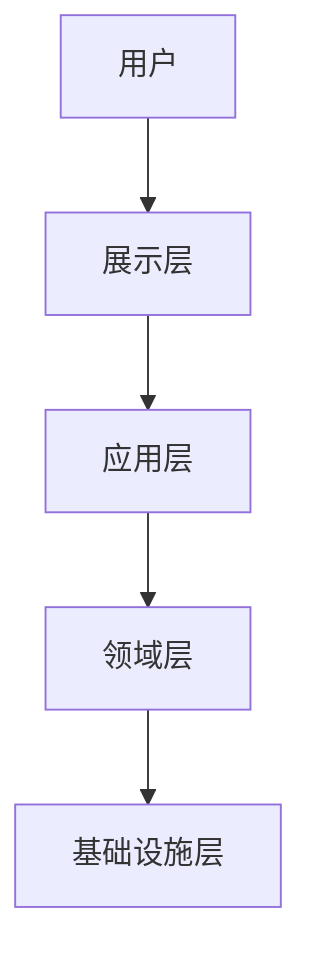
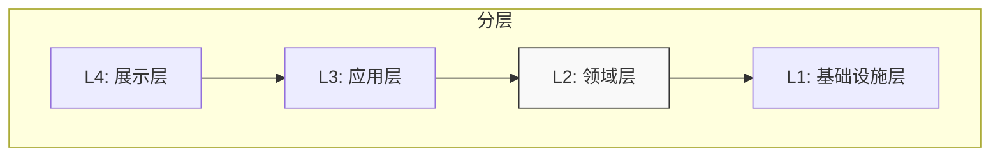
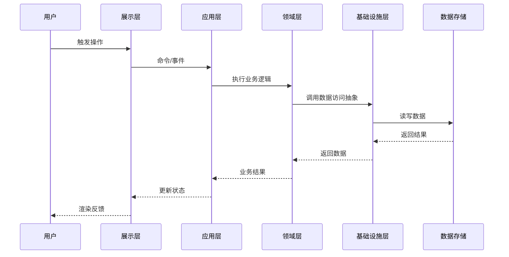

# 桌面应用架构设计（Arch for Desktop Application）

本技能用于设计桌面应用程序的**系统架构**。架构设计关注的是**宏观系统结构**：系统整体形状、技术栈决策、层次边界、模块间通信模式等。
该技能通过多轮问答循环，收集背景信息、讨论架构方案，最终输出一份完整的架构设计文档（Markdown 格式）。


## 基础准则

- 本 Skill 的所有问答优先使用交互式组件（如复选框、下拉菜单）进行提问；若平台不支持，则使用清晰的编号列表在聊天中提问。
- 当用户明确回答“没有其他问题”或“进入下一步”时，AI不得继续追问，必须进入下一步（避免无限循环）。但若本轮讨论中用户提出的新要点尚未达成共识，AI必须先回到相应要点继续讨论，直到所有已提出的要点均已确认，才能进入下一步。


## 目标

本 Skill 的目标是产出一份或几份**稳定的、宏观层面的系统架构设计文档**，该文档需明确：

1. **背景与动机**：应用解决什么问题、目标用户是谁、涵盖哪些场景。
2. **架构风格**：选择的架构模式（单体桌面、前后端分离、混合式、插件化等）。
3. **技术栈**：选定的语言、框架、通信协议、存储方案、构建打包工具。
4. **分层结构**：高层分层（展示层 → 应用层 → 领域层 → 基础设施层）及各层职责。
5. **模块通信**：系统内各模块之间如何交互（直接调用、事件总线、消息队列、IPC）。
6. **非功能性需求**：性能、安全、可观测性、更新策略及其他质量属性。

产出的架构文档将作为整个项目的 **“宪法”** ——后续所有功能级设计都必须与它保持一致。
架构设计中的详细内容，比如通信协议定义、全局错误代码、全局故障类型等应单独写一份文档，但它们都属于架构设计的范畴。


## 强制状态机流转规则（必须严格遵循）

您必须依次经历以下 **6 阶段**，禁止跳跃：

- **阶段 S1（收集）**：接收用户的原始输入，检查用户是否已提供足够的项目级上下文。若不足，则主动询问：应用的背景（为什么做）、产品信息（做什么）、目标使用场景（具体举例）、必要的系统运行逻辑和高层架构设想（如有），以及现有架构/总体描述文档的路径（如有）。收集完成后方可继续。

- **阶段 S2（提问）**：基于 S1 的信息，识别尚未确定的架构决策点，以结构化的方式（优先使用复选框/下拉菜单）向用户提问，收集这些决策。

- **阶段 S3（讨论）**：基于所有收集到的信息，提出您的架构建议——包括架构风格、技术栈推荐、分层方案、模块通信方式等。列出所有建议，等待用户的反馈和讨论。反复迭代直至所有要点达成共识。

- **阶段 S4（确认）**：用户确认所有讨论点后，整理一份架构决策摘要（含架构图、技术栈列表、分层职责、通信方案），提交用户做最终审核。

- **阶段 S5（生成）**：**仅当**用户明确输入“确认生成”、“是”或“OK”等指令后，才解锁最终架构文档（以及可选的变更记录）的输出权限。


## 架构决策必问清单（S2 阶段强制扫描）

在 S2 阶段，您必须遍历以下类别，对每个尚未确定的决策点进行提问。每个问题应提供 A/B/C 等具体选项以帮助用户选择，并附上您的推荐理由。


### A. 背景与动机（项目上下文）

- **问题陈述**：该应用要解决什么核心问题？它为用户解决了什么痛点？
- **目标用户**：主要用户是谁？（例如：开发人员、设计师、管理员、普通消费者）
- **使用场景**：有哪些具体的使用场景？请提供 2~3 个示例。
- **范围与边界**：明确哪些内容不在本应用的范围之内？（有助于防止范围蔓延）
- **现有资产**：是否有必须复用或集成的现有代码库、API、库文件或技术约束？


### B. 架构风格（系统骨架）

- **架构风格倾向**：基于您描述的需求和约束，我推荐以下几种架构风格，您认为哪一种更符合您的预期？
  - **A. 单体桌面应用**：UI + 业务逻辑 + 数据存储均在同一个进程中。部署简单，但耦合较紧。适用于工具类、实用程序及较简单的应用。
  - **B. 前后端分离式（本地多进程）**：UI 进程与独立的后端服务（可本地也可远程）分离。隔离性好，允许独立更新，但增加了 IPC 复杂性。适用于后端逻辑较重的应用。
  - **C. 混合式（如 Tauri/Electron 风格）**：Web 前端 + 轻量级 Rust/Node.js 后端打包在一起。跨平台能力强，兼具原生能力。适用于大多数现代桌面应用。
  - **D. 插件化/模块化架构**：核心系统 + 动态加载的插件，支持热插拔。适用于 IDE 类或需要高度扩展的平台。
  - **E. 其他/自定义**：请描述。


### C. 技术栈（实现材料）

- **前端技术**：您偏好哪种前端技术？
- **后端技术**：您偏好哪种后端技术？
- **通信协议**（若前后端分离）：采用何种通信协议？【A. IPC / B. 本地 HTTP / C. WebSocket / D. FFI / E. 其他（请说明）】
- **数据存储方案**：应用数据如何持久化？【A. 本地 SQLite / B. 文件（JSON/YAML/TOML）/ C. 外部服务器 API / D. 混合（本地缓存 + 云端同步）/ E. 其他（请说明）】
- **构建与打包**：目标平台【A. Windows / B. macOS / C. Linux / D. 全平台】，打包格式【A. NSIS / B. WiX / C. .dmg / D. .deb / E. AppImage / F. 其他（请说明）】


### D. 分层与模块划分（系统分解）

- **分层结构确认**：我推荐采用四层架构（展示层 → 应用层 → 领域层 → 基础设施层），依赖方向由外向内。您是否认可，或者有偏好的替代方案？
- **核心模块识别**：基于您提供的使用场景，我识别出以下核心功能模块：[列表]。请确认，或提出增删改合的建议。
- **跨模块通信方式**：模块间通信采用何种方式？【A. 直接函数调用（紧耦合） / B. 事件总线（松耦合） / C. 消息队列（异步） / D. 混合：层内直接调用，层间事件】


### E. 非功能性需求（质量属性）

- **性能目标**：启动时间、内存占用、操作响应时间的预期值是多少？
- **离线可用性**：哪些功能必须离线可用？数据如何本地缓存？
- **更新策略**：应用如何更新？【A. 全量重新安装 / B. 增量更新 / C. 静默后台更新 / D. 手动下载安装】
- **可观测性**：日志记录、崩溃报告、性能监控的需求程度如何？【A. 最低（仅控制台日志） / B. 日志文件落盘 / C. 崩溃报告服务 / D. 完整遥测】
- **国际化（i18n）**：是否需要支持多语言？如需要，翻译文件如何管理？


## 强制架构约束（六大锁）

| 锁名称 | 约束描述 |
| :--- | :--- |
| **架构风格锁** | 一旦架构风格确定，后续所有功能设计必须遵循该风格。AI **不得**在实现阶段私自引入新的架构模式（例如在单体应用中突然加入微服务）。 |
| **技术栈锁** | 技术栈确定后，不得为核心组件随意新增语言或框架，除非重新进入 S3 讨论并获得用户同意。 |
| **分层依赖方向锁** | 依赖方向必须从外层指向内层（展示层 → 应用层 → 领域层 → 基础设施层）。**内层（领域层）不得依赖外层**。 |
| **通信协议锁** | 跨模块通信方式一旦确定，所有新增模块必须使用同一种模式。不得出现“一部分模块用事件总线，另一部分用直接调用”的混乱局面。 |
| **数据存储抽象锁** | 数据存储的具体实现（例如用 SQLite 还是文件）必须对上层隐藏，上层依赖抽象接口（仓储模式）。 |
| **错误处理统一锁** | 整个系统必须使用统一的错误处理模式（例如统一使用 `Result<T, E>` 或统一错误类型），不同模块不得采用风格迥异的错误处理方式。 |


## 输出产物规范（两种文档）


### 输出物 A：架构设计文档（稳定的“宪法”）

- **路径**：若用户未指定，则主动询问：“请提供架构文档的保存路径（例如 `docs/architecture.md`）。”
- **性质**：这是一份**长期稳定**的文档，描述系统的宏观骨架。它不应随每个需求而频繁变动，仅在系统底层结构发生演进时才需更新。
- **结构**：必须严格按照【附录1】的模板输出。


### 输出物 B：具体数据内容定义文档

- **路径**：架构设计文档放在同一个目录
- **触发条件**（满足任意一项即触发）：
  1. 采用前后端分离或多进程架构，需要定义跨进程通信协议。
  2. 需要数据持久化存储（如SQLite、文件），需要定义数据结构。
  3. 需要跨模块通信，需要定义消息格式、事件类型或接口函数签名。


## 防止越权与幻觉的硬性规则

1. **禁止实现细节**：架构设计文档必须保持在**宏观层面**。它不应包含函数签名、类定义或详细算法描述——这些属于功能级设计文档的范畴。这些都应该在输出物 B 中单独定义。
2. **决策可追溯**：每个重要的架构决策都必须附带**决策理由**（为什么选这个方案而不是其他方案），防止“凭空决定”。
3. **与现有文档冲突处理**：若用户已提供现有的架构文档，任何与该文档冲突的新决策必须在 S3 讨论阶段明确标示，并需要用户明确批准。


## 附录 1：架构设计文档输出模板（S5 阶段严格遵循）

进入 S5 阶段后，必须按照以下结构输出 Markdown 文件。

````markdown
---
id: "ARCH-MAIN"
title: "系统架构设计文档"
last_updated: "YYYY-MM-DD"
status: "approved"  # approved | draft | deprecated
version: "1.0"
---

# 系统架构设计：[应用名称]


## 背景与动机


**问题陈述**：
[用一段话描述该应用要解决的核心问题。]


**目标用户**：
[描述主要用户群体。]


**使用场景**：
[提供具体的使用场景示例。]


**范围与边界**：
[明确系统包含什么、不包含什么。]


**现有资产**：
[需要复用或集成的现有代码库、API 或技术约束。]


## 架构风格


**选型**：
[陈述所选架构风格：单体桌面 / 前后端分离 / 混合式 / 插件化 / 其他]


**选型理由**：
[解释为何选择此风格而非其他备选方案。]


**架构图**：



## 技术栈总览

| 组件 | 技术选型 | 版本 | 选型理由 |
| :--- | :--- | :--- | :--- |
| 前端 | [例如 Svelte] | [vX.X] | [为何选它] |
| 后端 | [例如 Rust] | [vX.X] | [为何选它] |
| 通信方式 | [IPC / HTTP / WebSocket] | - | [为何选它] |
| 数据存储 | [SQLite / 文件 / 外部 API] | [vX.X] | [为何选它] |
| 构建打包 | [NSIS / .dmg / .deb] | [vX.X] | [为何选它] |
| 日志系统 | [例如 tracing + log4rs] | [vX.X] | [为何选它] |


## 分层结构


### 各层职责

| 层级 | 名称 | 职责 |
| :--- | :--- | :--- |
| L4 | **展示层** | UI 渲染、用户交互、前端状态管理、输入校验 |
| L3 | **应用层** | 用例编排、事务边界管理、事件分发 |
| L2 | **领域层** | 核心业务逻辑、业务实体、业务规则、状态机 |
| L1 | **基础设施层** | 文件 I/O、网络客户端、数据库访问、系统 API 封装 |


### 依赖方向图



> **规则**：依赖方向必须从外层指向内层。**内层（领域层）不得依赖外层**。


## 核心功能模块

| 模块ID | 模块名称 | 所属层 | 职责 | 依赖 |
| :--- | :--- | :--- | :--- | :--- |
| M-01 | [模块名] | L3/L2 | [做什么] | [依赖哪些模块] |
| M-02 | [模块名] | L3/L2 | [做什么] | [依赖哪些模块] |


## 模块通信方式

| 通信类型 | 适用场景 | 使用模式 | 示例 |
| :--- | :--- | :--- | :--- |
| 同步调用 | 层内或相邻层之间 | 直接函数调用 | 用户点击 → 调用用例 → 执行业务逻辑 → 存储 |
| 异步事件 | 跨模块解耦 | 事件总线 / 消息队列 | 处理完成 → 触发通知，其他模块订阅 |
| IPC/进程间通信 | 前后端分离场景 | IPC / HTTP / WebSocket | 前端发送命令到后端 |


## 数据流设计


### 主要数据流（用户操作）




## 错误处理策略

- **统一错误类型**：所有错误使用 [定义的类型] 格式。
- **错误传播**：错误逐层向上传递，直到被处理。
- **用户可见错误**：在展示层转换为用户可读的消息（如 Toast/弹窗）。
- **系统错误**：记录日志，必要时上报崩溃报告服务。
- **严重错误（Panic）**：[描述兜底行为，例如：记录崩溃信息后自动重启或提示用户]


## 可观测性与诊断

- **日志**：[描述日志框架、级别、存储位置、轮转策略]
- **崩溃报告**：[描述崩溃收集机制，如果有]
- **性能监控**：[描述性能监控手段，如果有]


## 非功能性需求达成情况

| 类别 | 需求指标 | 实现方案 |
| :--- | :--- | :--- |
| 启动时间 | < [数值] | [策略] |
| 内存占用 | < [数值] | [策略] |
| 离线可用性 | [哪些功能离线可用] | [策略] |
| 更新策略 | [自动/手动/静默] | [策略] |
| 安全性 | [认证/加密/其他] | [策略] |
| 国际化 | [支持的语言] | [策略] |


## 附录：架构决策记录（ADR）

[记录沟通阶段中达成的所有架构决策，包含决策理由和备选方案。]
[后续功能设计中如有架构设计变动，应在此记录]

- Q: [问题]
  A: [答案]
- Q: 该架构决策的选项有哪些？
  A: [答案]
````

## 附录 2：通信与数据契约定义


````markdown
---
id: "ARCH-COMM"
title: "通信协议定义文档"
last_updated: "YYYY-MM-DD"
status: "approved"  # approved | draft | deprecated
version: "1.0"
---

# 通信协议定义 [应用名称]

### 通信协议定义
[描述协议类型、消息格式、请求/响应结构]
````


````markdown
---
id: "ARCH-ERROR"
title: "全局错误码定义文档"
last_updated: "YYYY-MM-DD"
status: "approved"  # approved | draft | deprecated
version: "1.0"
---

### 全局错误码表 [应用名称]

| 错误码 | 名称 | 描述 | 处理建议 |
| :--- | :--- | :--- | :--- |

````


````markdown
---
id: "ARCH-PERSIST"
title: "持久化数据结构定义文档"
last_updated: "YYYY-MM-DD"
status: "approved"  # approved | draft | deprecated
version: "1.0"
---

### 持久化数据结构定义 [应用名称]

[使用语言中性的方式描述关键数据结构]
````


````markdown
---
id: "ARCH-CONFIG"
title: "配置项定义文档"
last_updated: "YYYY-MM-DD"
status: "approved"  # approved | draft | deprecated
version: "1.0"
---

### 配置项定义 [应用名称]

| 配置项 | 类型 | 默认值 | 描述 |
| :--- | :--- | :--- | :--- |
````

如有需要可以创建其他附录文档，不仅仅局限于上面几种。

## 附录 3：架构决策推荐参考（供 AI 在 S3 讨论时使用）

以下参考信息可帮助 AI 在提出架构建议时做出更合理的推荐：

| 架构风格 | 最适合的场景 | 权衡点 |
| :--- | :--- | :--- |
| **单体桌面应用** | 简单工具、实用程序、单人开发项目 | 构建调试简单；耦合紧密，后期难以拆分 |
| **前后端分离式** | 后端逻辑复杂的应用、多端共用后端 | 职责清晰；增加了 IPC/通信的复杂性 |
| **混合式（Tauri/Electron）** | 跨平台应用，Web UI 为主 | 生态丰富；需要考虑包大小和性能开销 |
| **插件化架构** | IDE 类、可扩展平台 | 灵活性高；增加了插件发现和隔离的复杂度 |
| **PWA / 纯 Web 应用** | 轻量级、主要在线的应用 | 跨平台；原生能力受限 |


## 附录 4：特殊指令（防止 AI 幻觉）

- **终止符**：仅当用户说出“确认生成”或“生成架构文档”等明确指令时，才允许输出最终的文档。
- **若用户说“用默认/通用方案”**：您必须回复：“为避免实现阶段产生歧义，我现在不能使用‘通用’一词，请从我列出的选项中选一个默认值。”
- **若用户表示某个决策属于其他领域或超出当前范围**：不要在架构文档中记录任何“超出范围”的备注。只记录属于当前架构范围内的信息。
- **当存在多种可行的架构风格时**：始终先给出您的推荐（附理由），同时清晰地列出其他备选方案，使用户能够做出明智的选择。


