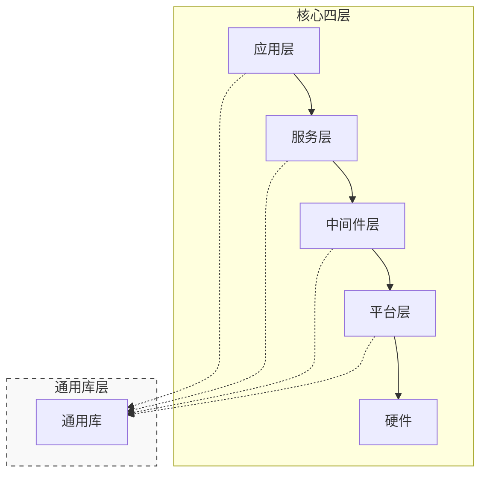
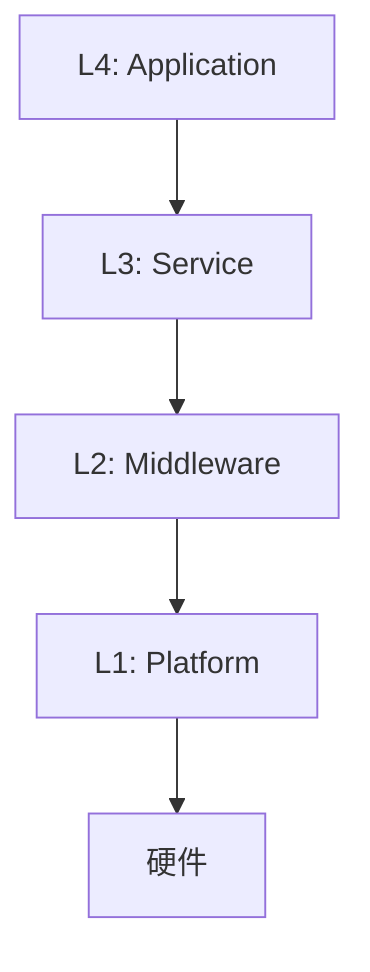

# Design for Embedded Software


## 目标

本 Skill 的目标是：为嵌入式系统（STM32/ARM、RTOS/裸机、C/C++/Rust）提供结构化的设计契约输出，确保在编码阶段开始前，以下四个维度被严格锁定：

1. **硬件资源分配**：引脚、外设总线、中断向量、DMA 通道的具体分配与冲突检查。
2. **模块化分治结构**：系统分层、模块职责边界、接口签名与状态封装方式。
3. **内存与执行时序**：Flash/RAM 增量估算、执行上下文分类（ISR / Task / 轮询）、截止时间（Deadline）与超时策略。
4. **错误处理策略**：错误在各层级的传播路径（内部消化 / 透传 / 系统复位）。

输出物以“增量需求设计文档”为主，当设计引入了新的通用组件、全局枚举或修改了链接脚本/中断向量表时，条件触发“通用架构文档”的同步更新。


## 核心设计原则

设计输出必须同时体现以下两个维度的考量：

### 宏观架构视图（分治策略）
- 将复杂系统拆分为职责清晰的模块，严格遵循通用嵌入式设计层级架构（平台层，中间件层，服务层，应用层，通用库层，具体内容请参考附录1）。
- 输出模块依赖关系图，明确数据/控制流在各模块间的传递方向。
- 每个模块的职责必须用一句话说清，避免“万能模块”。

### 微观底层视图（封装策略）
- 每个模块内部维护的状态（上下文、缓存、句柄）必须对外不可见。
- 对外仅暴露稳定的接口函数（API），接口签名一旦在设计阶段确认，编码阶段不得修改。
- 接口定义必须先于实现细节产出（Interface-First）。
- 模块内部也可以有内部层级划分，但必须遵循“状态隐藏原则”，对外不可见。


## 强制设计约束


### 硬件锁（物理层面）

- **外设冲突锁**：必须列出本次涉及的全部 GPIO、外设总线、DMA、中断号。与通用架构文档中已记录的资源进行冲突比对，不允许两个应用模块同时持有一个外设的实例，如果需要必须将该外设抽象为服务，并做好排他。
- **内存水位线锁**：必须估算 Flash（`.text`）和 RAM（`.data/.bss/.heap`）的增量。**ISR 中严禁动态内存分配**。新增缓冲区须明确为静态分配或堆分配。
- **执行上下文锁**：每段逻辑须归类为：ISR / RTOS Task（注明栈大小与优先级）/ Super Loop 轮询 / 上电一次性初始化。
- **实时性锁**：明确最大允许执行时间（Deadline），超时后的行为（返回错误码 / 看门狗复位 / 丢弃数据）。


### 模块化原则（逻辑层面）

- **接口优先原则**：在描述任何实现细节之前，必须先产出接口定义（`.h` 头文件或 `.rs` Trait）。接口签名一经输出即锁定。
- **状态隐藏原则**：模块内部的上下文/缓存/句柄须对外不可见（C 用 `static`/不透明指针，C++ 用 `private`，Rust 用私有字段）。
- **错误传播明确原则**：明确错误在本模块内部消化（重试/降级）、向上层透传错误码、还是触发全局钩子。


## 强制工作流（四状态问答闭环）

输出生成前必须严格经历以下五个阶段，**禁止跳跃**：

- **S1 收集**：解析用户提供的需求 Spec（Markdown），提取核心功能点和已确认的决策记录。
- **S2 追问**：针对本次需求尚未明确的条目，以**选择题**形式向用户提问（也可以让用户自定义答案）。若用户回答“随便/都行”，须给出两个具体选项逼其选择。需要参考从下方【嵌入式必问清单】。（如果可以，使用窗口视图的方式进行提问，而不是直接将问题输出到聊天频道）。
- **S3 讨论**：询问用户的设计偏好（包括技术栈，层级结构规划），给出你的全部设计要点，并等待用户的反馈。当用户反馈并讨论完所有的设计要点后，需要询问用户是否有还有其他问题，用户回答没有后进入下一步。
- **S4 确认**：用户回答并确认没有新的问题后，整理一份《设计决策摘要》（表格形式，含引脚、优先级、栈大小、模块划分），提交用户确认。
- **S5 生成**：**仅当**用户明确输入“确认生成”或“可以”后，按照第 6 节模板输出最终设计文档。

如果在进入S1前找不到整体项目背景或基础的架构设计内容，或信息不足，需要先进入S0阶段：

- **S0 背景**：让用户提供项目的基础信息，包括背景（为什么要做这个），目的（想要做一个什么东西），目标使用场景（举例），技术栈（可以预先进行推荐），软件架构（分层结构，模块划分，通信方式等，可以预先进行推荐），以及通用架构文档的路径（如果有）。如果用户没有提供这些信息，需要主动追问。确认完成后，如果没有文档路径，需要询问用户是否需要创建一个新的通用架构文档，并让用户指定路径和文件名。


### 【嵌入式必问清单】（S2 阶段强制扫描）

[所有问题 AI 须先给出建议方案，再让用户确认]

**A. 硬件与资源类**
1. 该功能运行在何种现场？【A. 上电初始化（一次性）/ B. 主循环轮询（周期性）/ C. 外部中断触发（异步）/ D. RTOS 独立任务（并发）】
2. 若选 D（RTOS任务），任务栈大小建议为？【A. 256 bytes / B. 512 bytes / C. 1024 bytes】；优先级置于现有任务中的哪个位置？
3. 列出该功能所需的全部 GPIO、外设总线、DMA 通道、中断，让用户指定选用的具体资源，并与通用架构文档中已记录的资源进行冲突检查。

**B. 模块化与分治类**
1. 模块拆分方案。
2. 错误传播策略：底层驱动失败时，【A. 模块内部重试 3 次后报错 / B. 立即向上层透传错误码 / C. 触发系统复位】？
3. 模块间的通信方式：【A. 直接函数调用 / B. 消息队列 / C. 信号量 / D. 事件回调】？

**C. 调试与非功能类**
1. 调试日志：【A. 仅在 Debug 构建中启用 / B. 完全禁用以节省 Flash】
2. 截止时间（Deadline）：【A. 硬实时 < 1ms / B. 软实时 < 100ms / C. 无限制】


## 输出产物规范（双文档机制）


### 输出物 A：增量需求设计文档
- **路径**：由用户指定，如果用户没有指定需要主动询问。
- **性质**：增量设计文档。仅描述“为了满足此需求，在现有工程上新增/修改了哪些内容”。
- **必须包含**：模块依赖图（Mermaid）、新增/修改文件列表、接口签名代码（骨架）、私有状态清单、硬件资源分配表、编译尺寸估算、错误处理表。


### 输出物 B：通用架构文档（条件触发更新）

- **路径**：需要用户指定通用架构文档所在的文件/文件夹路径（如果用户没有指定需要主动询问）。然后由 AI 分析需要修改哪些文档，给出需要修改的文档路径。
- **触发条件**（满足任一即须同步更新）：
  1. 本次新增的模块属于**通用基础组件**（如 Flash 驱动、全局日志模块），未来可被多个需求复用。
  2. 本次引入了**新的全局枚举/错误码/事件类型**，需跨模块共享。
  3. 本次修改了**链接脚本**、**中断向量表**或**RTOS 全局配置**。
- **同步动作**：在输出物 A 的末尾附带一节《全局架构同步检查单》，列出须同步的具体条目，并生成对应的追加内容草稿。
- **注意**：通用架构文档的更新必须经过人工确认，AI 不得直接修改原文档。


## 防止越权与幻觉的硬性规则

1. **零实现原则**：S5 生成的设计文档中，所有函数体内只允许出现 `// TODO` 占位语句，**严禁写出具体业务逻辑实现**。
2. **文件路径锚定**：所有提及的源文件路径须基于用户提供的工程目录。若用户未提供，须在 S2 阶段追问。
3. **冲突即停**：若发现硬件资源在通用架构文档中已被占用且无法复用，须**中断生成**，仅输出冲突报告，等待用户裁决。


## 附录 1: 通用嵌入式设计层级架构

本 Skill 规定的通用嵌入式设计层级架构分为四层+一层，如下：

1. 应用层（Application Layer）：最高层级。应用层包含所有的顶级模块，他们通常是某个功能或核心业务逻辑的直接实现。负责管理业务直接相关的状态机、数据流和用户交互。应用层模块可以调用服务层模块或通过中间件层访问硬件，但不能直接访问硬件寄存器。应用层中的所有应用模块原则上不能直接相互调用，必须通过某些消息服务进行间接通信。
2. 服务层（Service Layer）：中间层。服务层模块提供对具有逻辑底层硬件的抽象和封装，通常实现特定的算法、协议或数据处理逻辑。服务层模块可以调用中间件驱动，但不能直接访问硬件寄存器。
3. 中间件层（Middleware Layer）：中间层。中间件层模块提供对底层驱动的进一步封装，通常实现跨平台的外设调用，操作系统或常用协议栈的封装。中间件模块可以向下调用平台层，但不能直接访问硬件寄存器。
4. 平台层（Platform Layer）：最底层，直接与硬件交互。类似于传统的 BSP 层 + HAL 层。包含硬件直接相关的驱动和第三方开源协议栈。通常全部为第三方开源代码。
5. 通用库层（Library Layer）：是四层+一层中的那个“一层”，独自树立于以上四层的右侧。原则上左边四层都可以直接调用库层的功能，但通用库层不能调用左边四层的任何模块。通用库层通常包含一些通用的算法、数据结构、工具函数等（比如日志打印，数学运算库），供其他层级模块使用。通用库层不能直接依赖任何硬件寄存器或外设。如果通用库层需要访问硬件资源，必须通过回调函数或接口函数的方式由上层传入。通用库层的接口也必须是通用的，不能依赖于某个特定平台的特性。

**备注：**

1. 应用层可以直接调用中间件层，也可以通过服务层调用中间件层，但不能直接访问平台层。比如应用层需要持有一个IO资源，他通常直接调用中间件层。但如果他要持有一个 Modbus RTU Client，他通常会通过服务层提供的 Modbus 协议栈来持有一个 Client 实例（此时他不关心是RTU还是TCP，这些都在服务层初始化时根据平台不同配置自动完成）。而不是直接调用中间件层的 UART 驱动。
2. 中间件层是对平台层的进一步封装，提供跨平台的接口。中间件层的接口不能直接依赖于某个特定平台的特性，必须做到跨平台通用。
3. 平台层通常是由第三方开源代码提供的，或者是由硬件厂商提供的。比如 STM32 的 HAL 驱动和 FreeRTOS 开源代码就是平台层的典型代表。平台层的接口通常是针对某个特定平台的特性进行封装的，不能做到跨平台通用。
4. 应用层和服务层都可能具有状态机，数据管理和独立的线程或任务。中间件层不具有状态机和独立的线程或任务。平台层不具有状态机和独立的线程或任务，但可能会有中断服务程序（ISR）来处理硬件事件。

层级关系可参考：




## 附录 2：增量需求设计文档输出模板（S5 阶段必须严格遵循）

进入 S5 阶段后，按以下结构输出。方括号 `[...]` 为占位符，须替换为实际内容。

````markdown
---
id: 与需求规格文档中 `id` 保持一致，格式为 `[FUNCTION]-[ID]`
jira_id: JIRA 任务号（可选）
author: 设计者姓名（可选）
status: "backlog"  # 可选值：backlog / implemented / outdated
---

# 嵌入式设计契约 (replace with [requirement id] - [requirement name])

## 1. 架构视图（分治方案）

### 1.1 模块依赖关系图




### 1.2 新增/改动模块职责清单

| 模块文件 | 所属层级 | 职责描述 | 依赖的外部模块 |
| :--- | :--- | :--- | :--- |
| `bsp_xxx.c/.h` | L2 (BSP) | 封装 xxx 寄存器读写 | `stm32f4xx_hal_xxx` |
| `service_xxx.c/.h` | L3 (Service) | 实现 xxx 滤波与状态机 | `bsp_xxx` |


## 2. 接口契约（接口优先）


### 2.1 [模块名] 头文件定义（代码骨架，仅占位）

```c
// 根据 S2 选择的语言风格生成对应语法
typedef struct xxx_handle_t* xxx_handle_t;

xxx_handle_t xxx_init(/* 依赖参数，如 I2C_HandleTypeDef* */);
int xxx_read(xxx_handle_t handle, /* 输出参数 */);
int xxx_write(xxx_handle_t handle, /* 输入参数 */);
```


### 2.2 [另一模块] 接口（如有）


## 3. 内部状态封装（状态隐藏）

> 以下变量仅在 `.c` 文件中以 `static` 定义，对外不可见。

| 变量名 | 类型 | 用途 |
| :--- | :--- | :--- |
| `s_hi2c` | `I2C_HandleTypeDef*` | 缓存传入的 I2C 句柄 |
| `s_dev_addr` | `uint8_t` | 设备地址 |
| `s_cache` | `struct xxx_data_t` | 最近一次读取的数据缓存 |


## 4. 硬件资源分配表

| 资源类别 | 具体分配 | 关联模块 | 冲突检查（参考 architecture-common） |
| :--- | :--- | :--- | :--- |
| GPIO | PxN (SCL), PxM (SDA) | `bsp_xxx` | 当前是否被占用？ |
| 外设 | I2Cx / SPIx | `bsp_xxx` | 是否与其他驱动共享？需加互斥？ |
| 中断 | 无新增 / EXTIx (若使用) | `bsp_xxx` | 优先级设定？ |
| DMA | 通道x（若使用） | `bsp_xxx` | 是否与其他外设冲突？ |
| Flash 增量 | ~ +X KB（估算） | - | - |
| RAM 增量 | `.bss/.data`: +Y bytes | - | **无堆分配** / 有堆分配（说明） |


## 5. 并发与执行模型

- **执行上下文**：[根据 S2 决策填充：A/B/C/D]
- **调用频率/触发条件**：[如 每 100ms 轮询一次 / 由外部中断触发]
- **阻塞风险**：[描述是否会阻塞主循环或高优先级任务，超时时间设置]
- **临界区保护**：[如适用，说明使用关中断、互斥量、信号量等机制]


## 6. 错误处理策略（错误传播明确）

| 错误场景 | 模块内处理方式 | 向上层返回码 / 动作 |
| :--- | :--- | :--- |
| I2C 设备无响应 | 重试 3 次，每次间隔 5ms | `-1 (ETIMEOUT)` |
| 数据校验失败（CRC错） | 丢弃本次数据，保留上次有效值 | `0`（成功，但数据未更新） |
| 参数无效（如空指针） | 断言或直接返回 | `-2 (EINVAL)` |


## 7. 全局架构同步检查单


> **本次设计是否需要更新通用架构文档？**


- [ ] **是** / **否**（勾选）
- **若“是”，须同步的具体条目**：
  1. 在 `common_error_codes.h` 中新增错误码 `ERR_XXX_TIMEOUT = 0x30`。
  2. 在 `common_peripheral_map.md` 中标记 I2Cx 已被 `bsp_xxx` 占用。
  3. （如有更多，按此格式列出）

**请确认以上设计决策无误后，回复“确认生成”以锁定此设计契约。**

````

> **说明**：上述方括号 `[...]` 和灰色提示仅为占位说明，实际输出时须全部替换为真实内容。
